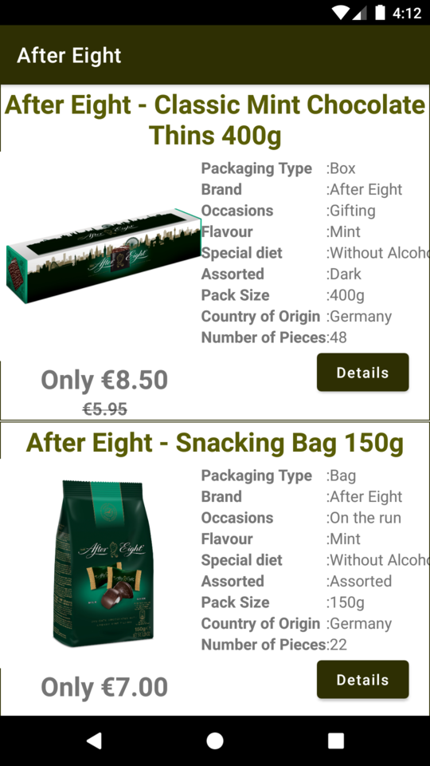

# antalyaDutyFree
Bu proje https://antalya.shopdutyfree.com/en/brandboutique/brand/all/ sayfasından başlayarak alt sayfalardaki verileri web scraping yöntemiyle çekerek hem uygulamanın içerisinde göstermeyi hemde veritabanı kaydı tutmayı sağlayacak şekilde geliştirilmiştir.

## Kullanılan teknolojiler
- [Jsoup](https://jsoup.org/) : Web sayfasından verilerin çekilmesi için kullanıldı.
- [Picasso](https://square.github.io/picasso/) : Ürün görsellerinin url üzerinden yüklenmesi için kullanıldı.
- [kotlinx.coroutines](https://github.com/Kotlin/kotlinx.coroutines) : Alt görevler oluşturmak amacıyla kullanıldı.

## Uygulama arayüz ve özellikleri

### [Açılış ekranı(SplashActivity)](app/src/main/java/com/hvk/antalyadutyfree/SplashActivity.kt)
- internet erişim kontrolü yapılarak uygulamanın sorunsuz çalışabilir durumda olması sağlanır.


- Herhangi bir internet erişimi bulunamazsa uygulama sonlandırılır.


### [Ana ekran(MainActivity)](app/src/main/java/com/hvk/antalyadutyfree/MainActivity.kt)
- Tüm markaların isim ve ürün sayfası linkleri çekilir.
- Marka isimleri alfabetik olarak kullanıcıya sunulur.


- İncelemek istenilen markaya tıklanarak ürünler kısmına geçilir.
- Geri tuşuna 2 kere basılması durumunda uygulamadan çıkılmaktadır.


### [Ürünler ekranı(ProductActivity)](app/src/main/java/com/hvk/antalyadutyfree/ProductActivity.kt)



- Uygulama çalışırken tek sefere mahsus olmak üzere sitedeki ürün bilgilerini çekmektedir. Elde edilen veriler hem arayüzde gösterilmekte hemde aynı sayfaya tekrar girilmesi durumunda hız ve kolaylık sağlaması amacıyla veritabanına kaydedilmektedir.
- İlgili markaya ait tüm ürünler kaydırmalı liste halinde kullanıcıya sunulur.
- Ürünlerin adı,güncel fiyatı,indirim yapılmış ise önceki fiyatı,detaylı bilgileri ve buton aracılığıyla görüntülenen açıklamaları yer almaktadır.


## Hazırlanan api ve özellikleri

### Marka bilgilerinin elde edilmesi
#### Kullanımı

````kotlin
brandList = ApiDutyFree(this).getAllBrandList()
````

- **this** : istek yapılan activity context'ini alır.
- **brandList** : ArrayList<[BrandModel](app/src/main/java/api/models/BrandModel.kt)>() gönderir.
#### Çalışma şekli
- Önceki kullanımdan kalan veritabanı temizlenir.
- tüm markaların isim ve ürünler sayfası linklerini websitesinde çekerek ArrayList halinde gönderir.
- ilgili verileri veritabanına kaydedilmekte olup tekrar kullanılmamaktadır.

### Ürün bilgilerinin elde edilmesi
#### Kullanımı

```kotlin
productList = ApiDutyFree(this).getAllProductList()
```

- **this** : istek yapılan activity context'ini alır.
- **productList** : ArrayList<[ProductModel](app/src/main/java/api/models/ProductModel.kt)>() gönderir.
#### Çalışma şekli
- ilgili markanın adı veritabanında kontrol edilir.
- Herhangi bir sonuç elde edilirse arayüze yüklenmesi için ArrayList haline getirilip gönderilir.
- Eğer ürünler sayfasına ilkkez girilmiş ise ürünlerin bilgileri websitesinde çekilir hem veritabanına kaydedilir hemde ArrayList halinde gönderilir.
- İlk seferinde üründe siteden çekildiği için birkaç saniye gecikme olabilmektedir.Daha sonraki girişlerde veriler veritabanından alındığı için gecikmesiz olarak gösterilmektedir.